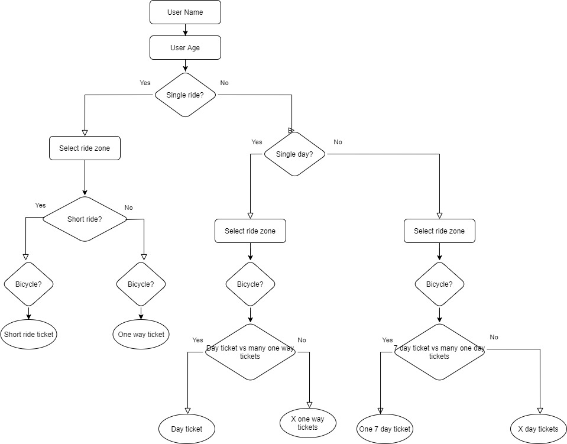

# Ninebarc Coding Challenge

You need to create a React application that:

Asks the user for their name.
Starts asking the user a question (it could be How much time are you planning on staying in the city but we leave it up to you how many and what kind of questions to ask), and based on the response it will ask another relevant question. This will simulate a simple decision tree.
At the end of the questionnaire, the application should recommend a ticket to the user in a final page that will also summarize the questions asked previously.

## Assumptions

- Travelling with bicycles BC = AB
- Day ticket AB=BC
- Seven day ticket AB=BC
- Seven day to day ticket comparison doesn't consider few trips spread on several days. Several one way tickets could be cheaper
- Day tickets need 1 bicycle ticket per trip
- Multiple rides could be further optimized by getting cheaper zone tickets on different days/rides
- One passenger can only bring one bicycle.

The decision tree on which the app is based is as follows:

## Design Decisions

- The app was created using create-react-app for simplicity and speed.
- The app was made having in mind separation of concerns, scalability and legibility.
- The business logic (prices, types of tickets and conditions) was abstracted to a json file to simulate data being fetched from the backend and make it easy to modify.
- Due to the relatively low amount of data and components, the state of the app is managed on a single component without the need of prop drilling.
- The app uses the same text input for all questions instead of customized inputs such as buttons or dropdown menus. For this reason it was important to develop a validation service that would make sure the supplied data complies with was is expected. 

## Observations

- The code would be considerably leaner if all the data could be entered by the user at the same time. Due to the way the challenge was designed this was not possible.

- It is recommended that the decision tree navigation logic (questionChangeHandler) be separated from the component and the UI and set apart on a service class or function, as well as a better fitting state management solution (ex: Redux or Context).

## How to run

Below are the create-react-app instructions to run and build the app.

# Getting Started with Create React App

This project was bootstrapped with [Create React App](https://github.com/facebook/create-react-app).

## Available Scripts

In the project directory, you can run:

### `npm start`

Runs the app in the development mode.\
Open [http://localhost:3000](http://localhost:3000) to view it in the browser.

The page will reload if you make edits.\
You will also see any lint errors in the console.

### `npm test`

Launches the test runner in the interactive watch mode.\
See the section about [running tests](https://facebook.github.io/create-react-app/docs/running-tests) for more information.

### `npm run build`

Builds the app for production to the `build` folder.\
It correctly bundles React in production mode and optimizes the build for the best performance.

The build is minified and the filenames include the hashes.\
Your app is ready to be deployed!

See the section about [deployment](https://facebook.github.io/create-react-app/docs/deployment) for more information.

### `npm run eject`

**Note: this is a one-way operation. Once you `eject`, you can’t go back!**

If you aren’t satisfied with the build tool and configuration choices, you can `eject` at any time. This command will remove the single build dependency from your project.

Instead, it will copy all the configuration files and the transitive dependencies (webpack, Babel, ESLint, etc) right into your project so you have full control over them. All of the commands except `eject` will still work, but they will point to the copied scripts so you can tweak them. At this point you’re on your own.

You don’t have to ever use `eject`. The curated feature set is suitable for small and middle deployments, and you shouldn’t feel obligated to use this feature. However we understand that this tool wouldn’t be useful if you couldn’t customize it when you are ready for it.

## Learn More

You can learn more in the [Create React App documentation](https://facebook.github.io/create-react-app/docs/getting-started).

To learn React, check out the [React documentation](https://reactjs.org/).

### Code Splitting

This section has moved here: [https://facebook.github.io/create-react-app/docs/code-splitting](https://facebook.github.io/create-react-app/docs/code-splitting)

### Analyzing the Bundle Size

This section has moved here: [https://facebook.github.io/create-react-app/docs/analyzing-the-bundle-size](https://facebook.github.io/create-react-app/docs/analyzing-the-bundle-size)

### Making a Progressive Web App

This section has moved here: [https://facebook.github.io/create-react-app/docs/making-a-progressive-web-app](https://facebook.github.io/create-react-app/docs/making-a-progressive-web-app)

### Advanced Configuration

This section has moved here: [https://facebook.github.io/create-react-app/docs/advanced-configuration](https://facebook.github.io/create-react-app/docs/advanced-configuration)

### Deployment

This section has moved here: [https://facebook.github.io/create-react-app/docs/deployment](https://facebook.github.io/create-react-app/docs/deployment)

### `npm run build` fails to minify

This section has moved here: [https://facebook.github.io/create-react-app/docs/troubleshooting#npm-run-build-fails-to-minify](https://facebook.github.io/create-react-app/docs/troubleshooting#npm-run-build-fails-to-minify)
